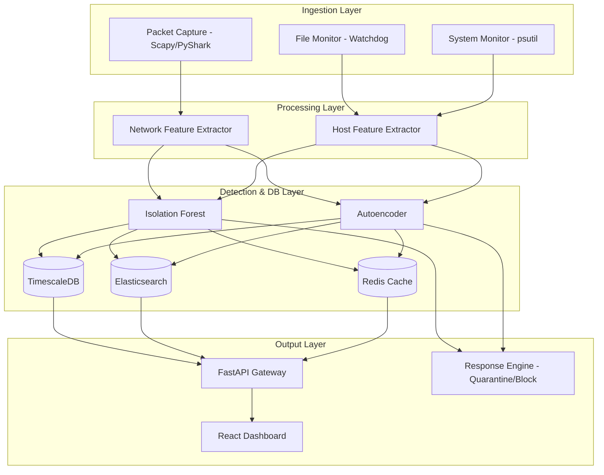

# AI-Based Zero-Day Threat Detection System

[](https://www.python.org/)
[](LICENSE)
[](#)

A high-performance, modular system monitoring and network analysis framework designed to detect zero-day threats, suspicious behaviors, and anomalous host activity in real-time. By combining file-system integrity monitoring, process-level behavior tracking, and rich network feature extraction, this system lays the foundation for advanced machine learning detection pipelines.

---

## 🚀 Key Features

*   **⚡ Real-Time Packet Capture & Replay**: Live network interface sniffing using `Scapy` and high-fidelity offline PCAP file replay using `PyShark`.
*   **📊 Dynamic Feature Extraction**: Extracts over 50+ network features including bidirectional flow metrics, TCP flags, rolling-window size/rate statistics, payload characteristics, and connection rates.
*   **📂 File Integrity Monitoring**: Event-driven file system auditing using `Watchdog` to track creation, modification, deletion, and relocation in sensitive directories.
*   **🖥️ Host & Process Auditing**: Continuous tracking of process lifecycles, socket states, and unauthorized access attempts to critical system files (e.g., `/etc/passwd`, Windows registry templates) using `psutil`.
*   **🛠️ Yaml-Powered Configuration**: Centralized, customizable configuration for detection thresholds, machine learning models, database backing, and automated quarantine pathways.
*   **🔒 Automated Incident Response (Ready)**: Configurable responses including host quarantining, connection blocking, and system alerts.

---

## 🗺️ System Architecture



---

## 📁 Repository Structure

```text
├── api/                   # REST API endpoints (FastAPI) for dashboard integration
├── configs/               # System & engine configurations
│   └── config.yaml        # Main configuration file
├── core/                  # Core processing engine
│   ├── detection/         # ML model definitions (Isolation Forest, Autoencoder, etc.)
│   ├── features/          # Feature extraction & normalization pipelines
│   │   └── network_features.py
│   ├── ingestion/         # Active sensor monitors (File, Network, Host)
│   │   ├── file_monitor.py
│   │   ├── packet_capture.py
│   │   └── system_monitor.py
│   ├── models/            # Trained models and pipeline artifacts
│   └── response/          # Incident response actions & alerting
├── dashboard/             # Front-end user interface
├── docker/                # Deployment configurations (Docker Compose, Dockerfiles)
├── intel/                 # Threat intelligence connectors (VT, MITRE ATT&CK, NVD)
├── scripts/               # Management, setup, and helper scripts
├── tests/                 # Automated unit, integration, and load tests
├── .env.example           # Environment variables template
└── requirements.txt       # Project python dependencies
```

---

## 🛠️ Getting Started

### Prerequisites

*   **Python**: Version `3.8` or higher.
*   **Tshark/Wireshark**: Required for PCAP parsing using `PyShark`.
    *   **Ubuntu/Debian**: `sudo apt install tshark`
    *   **macOS**: `brew install wireshark`
    *   **Windows**: Download installer from [Wireshark Official Site](https://www.wireshark.org/).

### Installation

1.  **Clone the Repository**:
    ```bash
    git clone https://github.com/yourusername/AI-Based-Zero-Day-Threat-Detection.git
    cd AI-Based-Zero-Day-Threat-Detection
    ```

2.  **Create a Virtual Environment**:
    ```bash
    python -m venv venv
    # On Windows:
    venv\Scripts\activate
    # On Linux/macOS:
    source venv/bin/activate
    ```

3.  **Install Dependencies**:
    ```bash
    pip install -r requirements.txt
    ```

4.  **Configure the Environment**:
    Copy the environment variables template and configure your API keys (e.g., VirusTotal, NVD):
    ```bash
    cp .env.example .env
    ```

5.  **Edit System Settings**:
    Modify [configs/config.yaml](file:///h:/D%20Drive/projects/AI-Based%20Zero-Day%20Threat%20Detection/configs/config.yaml) to tune model sensitivites, target directories, network filters, and DB connections.

---

## 🚀 Running the System

You can run individual monitors directly to verify sensor health:

### File System Monitoring
Monitors downloads, desktop, and system directories in real-time:
```bash
python core/ingestion/file_monitor.py
```

### System & Process Monitoring
Tracks process lifecycles, network socket state changes, and suspicious access to sensitive system paths:
```bash
python core/ingestion/system_monitor.py
```

### Live Packet Snipping
Sniffs traffic from local network interface (e.g., "Wi-Fi" or "eth0"):
```bash
python core/ingestion/packet_capture.py
```

---

## 🧪 Testing

The codebase includes standard unit tests to ensure stability. Run the test suite via `pytest`:

```bash
pytest tests/
```

For performance and load testing, utility scripts are configured to use `locust`:
```bash
locust -f tests/load_test.py
```

---

## 🔮 Future Roadmap

*   [ ] **Model Training Pipelines**: Add Scikit-Learn training wrappers for Isolation Forest and PyTorch training loop for autoencoders.
*   [ ] **MITRE ATT&CK Mapping**: Group process alerts to actual MITRE attack vectors and sub-techniques automatically.
*   [ ] **Auto-Quarantine Execution**: Sandbox files identified as malicious by isolating them into the `/quarantine` folder.
*   [ ] **Elasticsearch & TimescaleDB Integration**: Enable direct data persistence of network features and security events.

---

## 📄 License

This project is licensed under the MIT License - see the [LICENSE](LICENSE) file for details.
